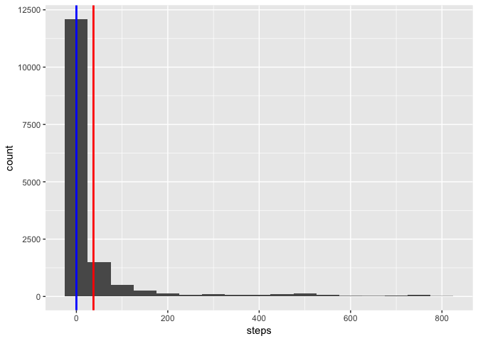
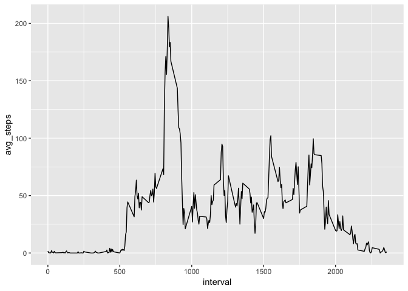
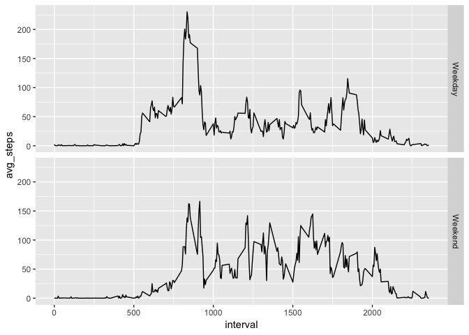

## Loading and preprocessing the data

We're going to use the Tidyverse packages (tibble, dplyr...) for this.


```r
library(tidyverse)
# Load data into a dataframe
df <- read_csv("activity.zip")
# Inspect the data to confirm it has been loaded properly
head(df, n=3); summary(df)
```

```
## # A tibble: 3 x 3
##   steps date       interval
##   <dbl> <date>        <dbl>
## 1    NA 2012-10-01        0
## 2    NA 2012-10-01        5
## 3    NA 2012-10-01       10
```

```
##      steps             date               interval     
##  Min.   :  0.00   Min.   :2012-10-01   Min.   :   0.0  
##  1st Qu.:  0.00   1st Qu.:2012-10-16   1st Qu.: 588.8  
##  Median :  0.00   Median :2012-10-31   Median :1177.5  
##  Mean   : 37.38   Mean   :2012-10-31   Mean   :1177.5  
##  3rd Qu.: 12.00   3rd Qu.:2012-11-15   3rd Qu.:1766.2  
##  Max.   :806.00   Max.   :2012-11-30   Max.   :2355.0  
##  NA's   :2304
```


## What is mean total number of steps taken per day?


```r
steps_mean <- round(mean(df$steps,na.rm=TRUE),2)
steps_median <- round(median(df$steps,na.rm=TRUE),2)

ggplot(data = df, aes(x=steps)) + geom_histogram(binwidth = 50) + 
    geom_vline(xintercept = steps_mean,col='red',size=1) +
    geom_vline(xintercept = steps_median,col='blue',size=1)
```

<!-- -->

The mean (red line) is 37.38 and the median (blue line) is 0. Both rounded to 2 decimals.


## What is the average daily activity pattern?


```r
# Create a new dataframe with the averages by interval
df %>% 
  group_by(interval) %>% 
  summarize(avg_steps = mean(steps,na.rm=TRUE)) -> df.avg

# Get the interval with the highest average to display in the text below
max.avg <- as.numeric((df.avg[which.max(df.avg$avg_steps),1]))

# Plot
ggplot(data=df.avg,aes(x=interval,y=avg_steps)) +
  geom_line()
```

<!-- -->

The highest average is found at interval 835.

## Imputing missing values


```r
# Get the number of rows with missing values
sum(!complete.cases(df))
```

```
## [1] 2304
```

```r
# Create a new dataframe replacing NAs with the average for the interval
df %>%
  group_by(interval) %>%
  mutate(steps = replace_na(steps,mean(steps,na.rm = TRUE))) -> df.nomiss

new_steps_mean <- round(mean(df.nomiss$steps),2)
new_steps_median <- round(median(df.nomiss$steps),2)

ggplot(data = df.nomiss, aes(x=steps)) + geom_histogram(binwidth = 50) + 
    geom_vline(xintercept = steps_mean,col='red',size=1) +
    geom_vline(xintercept = steps_median,col='blue',size=1)
```

<!-- -->

```r
summary(df.nomiss$steps)
```

```
##    Min. 1st Qu.  Median    Mean 3rd Qu.    Max. 
##    0.00    0.00    0.00   37.38   27.00  806.00
```

With this substitution strategy, the average isn't affected. The median *should* be affected, but we can easily check that more than half the initial values were zero in the first place:

```r
sum(df$steps==0,na.rm = TRUE) > nrow(df)/2
```

```
## [1] TRUE
```
As shown in the dataframe summary above, however, the 3rd quartile changes. We're skewing the distribution towards the mean.

## Are there differences in activity patterns between weekdays and weekends?


```r
# Create the new dataframe
df.nomiss %>% 
  mutate(IsWeekend = 
           factor(ifelse(weekdays(date) %in% c("Saturday","Sunday"),
                         "Weekend","Weekday"))) -> df.weekend

# Plot the averages
df.weekend %>%
  group_by(IsWeekend,interval) %>%
  summarize(avg_steps = mean(steps)) %>% 
  ggplot(aes(x=interval,y=avg_steps)) + 
  geom_line() +
  facet_grid(IsWeekend ~ .)
```

<!-- -->

Seems like there's less activity in earlier intervals during the weekend, but slightly more at later intervals.
